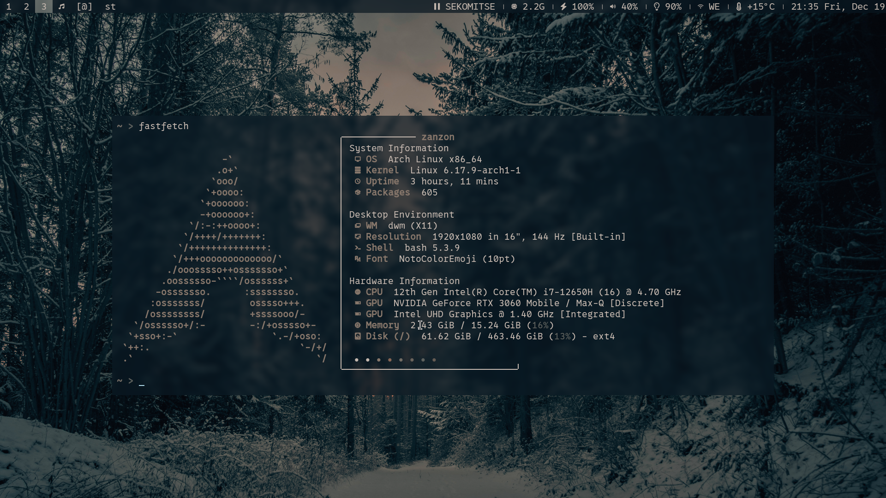

# DWM Personal Build

This is my customized build of [dwm](https://dwm.suckless.org/), a dynamic window manager for X.  
It includes my preferred patches and configuration for a more functional and aesthetic experience.



---

## Features / Applied Patches

The following patches are included in this build:

### Functionality
1. `dwm-actualfullscreen-20211013-cb3f58a.diff` – Fixes fullscreen behavior for certain applications.  
2. `dwm-attachbottom-6.3.diff` – New windows attach at the bottom of the stack.  
3. `dwm-pertag-6.2.diff` – Keeps layout settings per tag.  
4. `dwm-preventfocusshift-20240831-6.5.diff` – Prevents focus from automatically shifting.  
5. `dwm-push_no_master-6.4.diff` – Pushes new windows without changing the master.  
6. `dwm-scratchpads-20200414-728d397b.diff` – Adds scratchpad functionality for quick access terminals or apps.  
7. `dwm-restartsig-20180523-6.2.diff` – Adds support for restarting dwm via a signal without losing your session.  
8. `dwm-preserveonrestart-6.3.diff` – Preserves window layout and state when restarting dwm.  
9. `dwm-swallow-6.3.diff` – Enables terminal windows to “swallow” launched child windows, keeping the desktop clean.

### Appearance
1. `dwm-alpha-20250918-74edc27.diff` – Adds transparency support.  
2. `dwm-center-6.2.diff` – Centers floating windows.  
3. `dwm-hide_vacant_tags-6.4.diff` – Hides tags with no windows.  
4. `dwm-noborderfloatingfix-6.2.diff` – Fixes border behavior for floating windows.  
5. `dwm-vanitygaps-6.2.diff` – Adds customizable gaps between windows.  
6. `dwm-xresources-20210314.diff` – Allows runtime configuration via Xresources (necessary for pywal).  
7. `dwm-colorbar-6.3.diff` - Allows different coloring options for each bar component

---

## Installation

1. Clone this repository:
```bash
git clone https://github.com/Zanzon2004/dwm.git
```
2. Set colors:
Open config.def.h in your editor.
if you are using [pywal](https://github.com/dylanaraps/pywal) put your username in `#include "/home/<your-user>/.cache/wal/colors-wal-dwm.h"`, if not, just delete this line and apply your custom colorscheme using hexcolors.

3. Compile and install
```bash
cd dwm
make install clean # this needs admin privilege (sudo/doas)
```
5. key bindings are managed through [sxhkd](https://wiki.archlinux.org/title/Sxhkd). This is cleaner and more efficient to avoid a hectic config file. 
